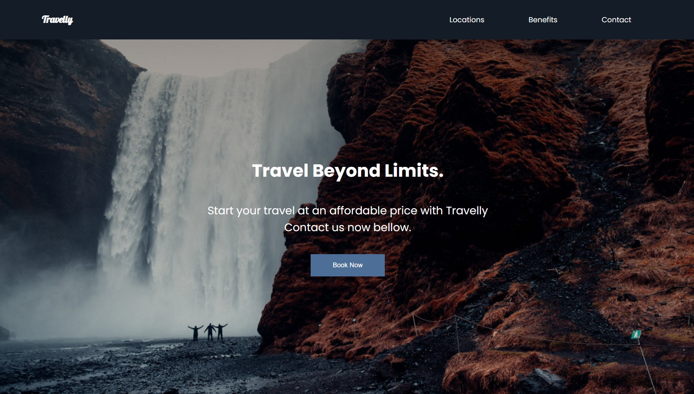
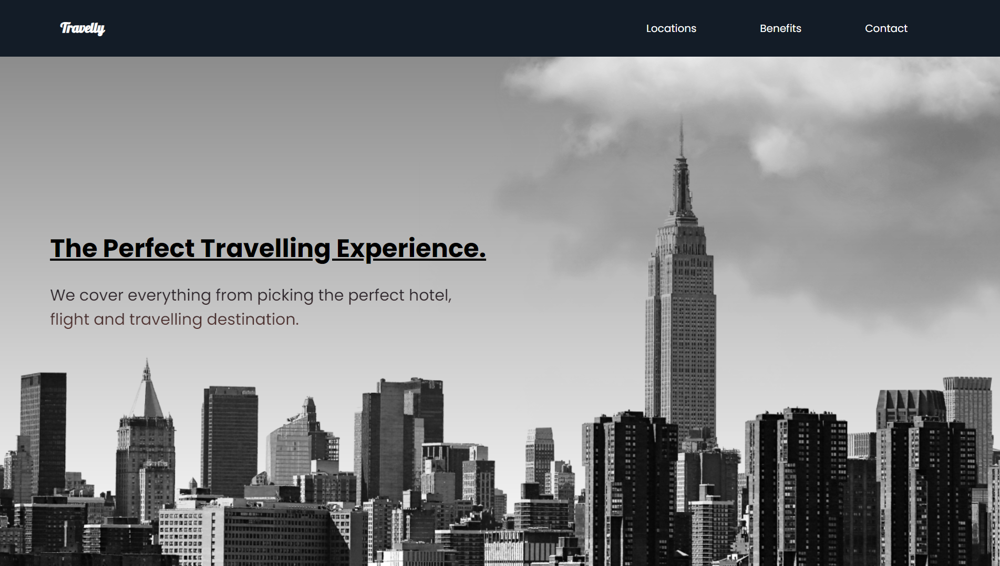

<h1 align="center" style="font-weight: bold;">Travelling Agency </h1>

 <a href="#tech">Technologies</a> • 

    <b>Project Description
Travelly is a travel agency website where you can start your journey at affordable prices. Through an intuitive contact form, you can send us a message to begin planning your dream trip.

This site was created as part of the course "The Creative HTML5 & CSS3 Course - Build Awesome Websites," with the goal of applying and enhancing new skills and techniques in HTML5 and CSS3./b>

     <a href="https://guithr.github.io/travelly-website/">📱 Visit this Project</a>

<h2 id="layout">🎨 Layout</h2>

    
    

<h2 id="technologies">💻 Technologies</h2>

- CSS3
- HTML5
